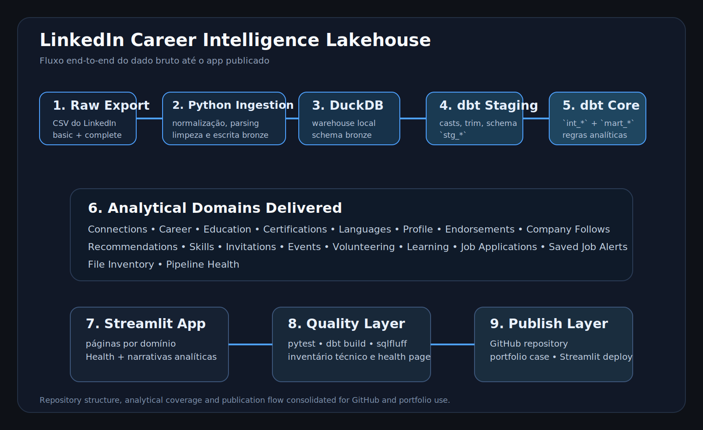
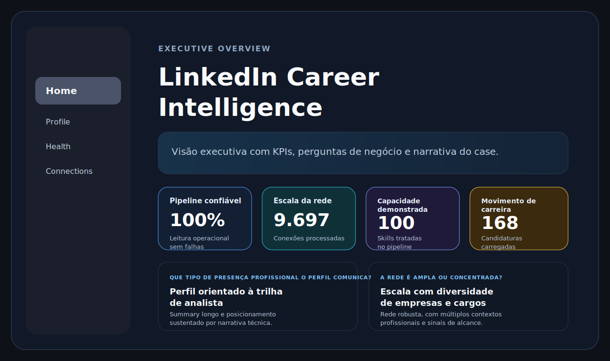
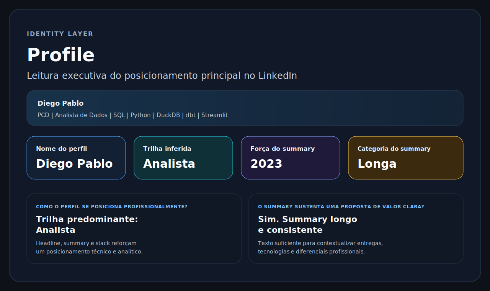
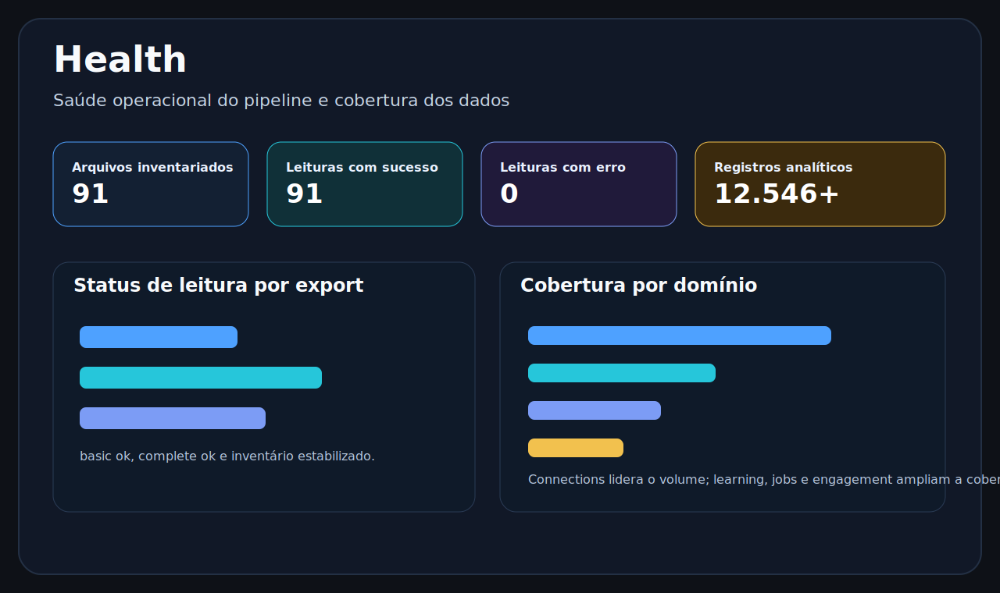

# LinkedIn Career Intelligence Lakehouse

Projeto de engenharia de dados e analytics que transforma exportações pessoais do LinkedIn em uma plataforma analítica com ingestão em Python, modelagem em dbt, armazenamento em DuckDB e consumo via Streamlit.

<p align="center">
  
</p>


## Objetivo

Construir um case de nível profissional que mostre:

- ingestão estruturada de múltiplos arquivos do export do LinkedIn
- organização por camadas `raw -> bronze -> staging -> intermediate -> marts -> app`
- modelagem e testes analíticos com dbt
- consumo em aplicativo Streamlit com visão executiva e exploratória
- separação clara entre exploração em notebooks e pipeline reproduzível

## Fluxo End-to-End

```text
CSV exportados do LinkedIn
-> Python ingestion layer
-> DuckDB local com schema bronze
-> dbt staging / intermediate / marts
-> Streamlit analytics app
-> publicação em GitHub / portfólio
```

## Domínios já cobertos

- Profile
- Connections
- Career / Positions
- Education
- Certifications
- Languages
- Endorsements
- Company Follows
- Recommendations Received
- Skills
- Invitations
- Events
- Volunteering
- Learning
- Job Applications
- Saved Job Alerts
- File Inventory / Pipeline Health

## Estrutura do repositório

- `linkedin_career_intelligence/`: pacote principal com configuração, utilitários DuckDB, helpers Streamlit e lógica de ingestão
- `scripts/run_ingestion.py`: carga consolidada das tabelas suportadas
- `scripts/run_pipeline.py`: execução end-to-end com ingestão, inventário e dbt
- `scripts/profiling/`: inventário técnico dos exports e artefatos de profiling
- `scripts/utils/`: inspeções operacionais do warehouse
- `linkedin_career_intelligence_dbt/`: staging, intermediate, marts, testes e configuração dbt
- `apps/`: dashboard Streamlit com páginas analíticas por domínio
- `data/raw/`: exports originais do LinkedIn
- `data/bronze/file_inventory/`: snapshots do inventário técnico dos arquivos encontrados
- `warehouse/`: arquivo local `.duckdb` usado pelo app e pelo dbt
- `notebooks/`: exploração, profiling e validação de regras antes de promover para código
- `profiles/`: profile local do dbt para rodar o projeto sem depender do home directory
- `docs/`: documentação complementar da arquitetura, operação e publicação

## Aplicativo Streamlit

Páginas disponíveis hoje:

- `Health`
- `Connections`
- `Career`
- `Education`
- `Certifications`
- `Languages`
- `Profile`
- `Endorsements`
- `Company Follows`
- `Recommendations`
- `Skills`
- `Engagement`
- `Learning`
- `Jobs`

## Galeria do app

<p align="center">
  
</p>

<p align="center">
  
</p>

<p align="center">
  
</p>

## Como rodar localmente

### 1. Instalar dependências

```powershell
python -m venv .venv
.venv\Scripts\Activate.ps1
pip install -r requirements.txt
```

### 2. Executar a ingestão

```powershell
python scripts\run_ingestion.py
python scripts\profiling\inventory_linkedin_exports.py
```

### 3. Rodar dbt

```powershell
dbt build --profiles-dir ..\profiles
```

Execute o comando a partir da pasta `linkedin_career_intelligence_dbt/`.

### 4. Subir o app

```powershell
streamlit run apps\Home.py
```

Se quiser testar explicitamente o modo público com a base sanitizada:

```powershell
$env:LINKEDIN_DB_PATH='demo/linkedin_career_intelligence_demo.duckdb'
streamlit run apps\Home.py
```

### 5. Rodar tudo de ponta a ponta

```powershell
python scripts\run_pipeline.py
```

## Modelagem do projeto

### Bronze

Camada física carregada pelo Python para o DuckDB com tabelas como:

- `bronze.profile`
- `bronze.connections`
- `bronze.positions`
- `bronze.skills`
- `bronze.invitations`
- `bronze.learning`
- `bronze.job_applications`

### Staging

Camada dbt para padronização leve dos dados brutos:

- `stg_profile`
- `stg_connections`
- `stg_skills`
- `stg_invitations`
- `stg_learning`
- `stg_job_applications`

### Intermediate

Camada dbt para enriquecimento, classificação e criação de campos analíticos:

- `int_profile_enriched`
- `int_connections_enriched`
- `int_skills_enriched`
- `int_invitations_enriched`
- `int_learning_enriched`
- `int_job_applications_enriched`

### Marts

Camada final para consumo do app:

- `mart_pipeline_health_summary`
- `mart_file_inventory_summary`
- `mart_connections_summary`
- `mart_career_progression`
- `mart_profile_summary`
- `mart_skills_summary`
- `mart_learning_summary`
- `mart_job_applications_summary`
- `mart_saved_job_alerts_summary`

## Decisões de arquitetura

- `silver` e `gold` existem como schemas possíveis no DuckDB, mas o fluxo atual materializa a jornada analítica principalmente em `bronze` + `main`
- notebooks são usados para exploração e validação, não para ETL oficial
- `intermediate` é mantida apenas quando gera enriquecimento reaproveitável
- páginas do app são orientadas por domínio de negócio, não necessariamente uma por CSV
- artefatos gerados como `target`, `logs`, `dbt_packages`, `pyc` e `.duckdb` foram ocultados do editor para reduzir ruído operacional

## Qualidade e operação

- `pytest` para regras Python
- `dbt build` para modelos e testes analíticos
- `sqlfluff` configurado para DuckDB + dbt
- `inspect_warehouse.py` para inspecionar o banco local sem precisar abrir o arquivo binário `.duckdb`

## Deploy público seguro

Para publicar o app sem expor o export privado do LinkedIn:

1. mantenha a base real em `warehouse/linkedin_career_intelligence.duckdb`
2. gere a base pública em `demo/linkedin_career_intelligence_demo.duckdb`
3. publique o app usando apenas os arquivos versionados do repositório

Comando para regenerar a base demo:

```powershell
$env:PYTHONPATH='.'
.\.venv\Scripts\python.exe scripts\utils\create_public_demo_db.py
```

Resolução do banco no app:
- `LINKEDIN_DB_PATH`, quando configurado explicitamente
- base privada em `warehouse/`, quando disponível
- base demo em `demo/`, quando a privada não existir no ambiente

Isso permite desenvolvimento local com dados reais e deploy público com dados anonimizados.

## Roadmap de publicação

Próximos passos naturais para entrega pública:

- revisão final de UX e narrativa do app
- publicação do repositório no GitHub
- criação de uma página de case no portfólio com prints, diagrama e stack
- eventual deploy do app em Streamlit Community Cloud ou similar

## Documentação complementar

- [Arquitetura](docs/architecture.md)
- [Guia de desenvolvimento](docs/development.md)
- [Roadmap](docs/roadmap.md)
- [Case assessment](docs/case_assessment.md)
- [Project Blueprint](docs/project_blueprint.md)
- [Publishing Checklist](docs/publishing_checklist.md)
- [GitHub Repo Copy](docs/github_repo_copy.md)
- [Portfolio Case](docs/portfolio_case.md)
- [Data Dictionary](docs/data_dictionary.md)
- [Runbook](docs/runbook.md)

## Autor

Diego Pablo  
GitHub: https://github.com/DiegoPablo2021/  
Portfolio: https://diego-pablo.vercel.app/  
LinkedIn: https://www.linkedin.com/feed/  
E-mail: diegopmenezes@hotmail.com
